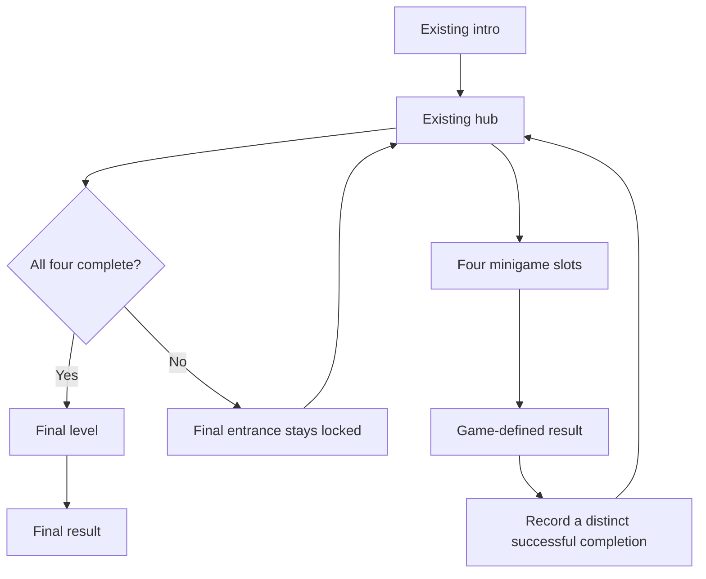

# Four minigames and a final level

Status: planning only. No modules, saved progress, requirements, gates, or gameplay described as proposed below are installed by this document.

## Confirmed scope

- Four minigames in total, plus one separate final level.
- The final level becomes playable only after all four minigames have been completed.
- The user will plan the games later. Names, mechanics, objectives, difficulty, and completion conditions remain open.
- Preserve the recovered `loadWebGL` world, HUD, GLBs, intro, and player controller. Keep the game single-player and portrait-first, with no phone or map.

Reserve design IDs `minigame-1`, `minigame-2`, `minigame-3`, `minigame-4`, and `final`. These are placeholders in the plan, not playable entries. Do not infer that survival or Temple Dash occupies a slot. Jump and dance remain existing player actions unless a later game design explicitly uses them.

The access rule means "after completing all four." It does not establish a one-attempt limit for the final level. Final-level retries and replay remain design decisions.

## Proposed player flow



Recommended default: the player chooses the four minigames in any order and can revisit completed games without losing completion. This is a proposal, not an additional confirmed requirement. No entrance placement or HUD redesign is specified yet.

## Existing integration points

| Current file | Observed responsibility | Future integration |
| --- | --- | --- |
| `three-js/src/engine.js` | Installs hub, survival, movement actions, paint, and HUD around the recovered engine | Install the campaign controller here only when implementation is requested |
| `three-js/src/hub.js` | `installHub` exposes survival and runner entry/return paths; saves survival phase, page, position, and camera | Route buttons and physical entrances through one entry method |
| `three-js/src/survival.js` | `installSurvival` owns start, pause, resume, replay, visuals, and result UI | Wrap its lifecycle if it is selected; report success before replay resets the run |
| `three-js/src/survival-model.js` | `checkOutcome` and `finishRun` emit `won` or `lost` | Existing success can be mapped by an adapter if the design keeps this game |
| `three-js/src/runner.js` | `installRunner` owns open, start, pause, close, camera, feedback, and local best score | Wrap its lifecycle if selected; preserve its cleanup and camera restoration |
| `three-js/src/runner-model.js` | `stepRunner` advances an endless run; collision changes its phase to `over` | A future design must define success; distance, score, or `over` must not be treated as completion automatically |

Survival run progress currently survives a hub visit within the session. Temple Dash stores its best score under `glorb-temple-best`. Neither is a campaign completion record. No existing save or score should be converted into a completion without a later, explicit migration decision.

## Proposed module boundaries

All paths in this table are future files. Keep the implementation in plain JavaScript modules to match the project.

| Proposed module | Owns | Does not own |
| --- | --- | --- |
| `three-js/src/campaign/catalog.js` | Exactly four stable minigame IDs and one final ID; later, their titles, definition versions, and adapter factories | Win conditions or mutable progress |
| `three-js/src/campaign/progress.js` | Pure completion model, result recording, completion count, and final-access predicate | DOM, rendering, storage, or game rules |
| `three-js/src/campaign/storage.js` | Versioned loading, validation, migration, and saving of campaign progress | Current scene or live gameplay state |
| `three-js/src/campaign/controller.js` | Active attempt, transitions, access checks, lifecycle calls, and result acceptance | Each game's scoring and objectives |
| `three-js/src/games/<id>/adapter.js` | Translation between one game's rules/controller and the shared lifecycle | Completion records for other games or final access |

The hub reads a progress snapshot and requests entry. It must not inspect game-specific scores or set completion flags. Each game reports an outcome; the campaign controller records it through the progress model. The final level uses the same adapter contract, with its own completion record outside the four-minigame count.

Keep each game's rule model separate from its renderer where practical, as the existing survival and runner modules already do. Do not require all games to share physics, scoring, timing, or internal phase names.

## Proposed adapter contract

Conceptual interface only; this is not runtime code:

```js
createAdapter({ app, scene, reportResult, requestHub }) => ({
  enter({ attemptId, mode }), // async; mode is new or resume
  pause(reason),
  resume(),
  restart({ attemptId }),    // async; creates a fresh attempt
  leave({ preserveRun }),    // async; releases scene and input ownership
  dispose(),                // releases owned listeners and resources
})

reportResult({ attemptId, outcome }) // outcome: completed, failed, or abandoned
requestHub()
```

The controller creates the attempt ID and binds the result callback to the chosen game ID and definition version. A game cannot select which slot receives credit. The adapter reports `completed` only when its eventual game-specific success condition is met. Launching, pausing, exiting, losing, or setting a personal best does not imply completion.

The controller accepts one terminal result per active attempt. Ignore repeated or stale callbacks, including callbacks from a game after it has been left. Restarting gets a new attempt ID. Replaying a completed minigame does not add another completion or clear its earlier success.

`preserveRun` concerns optional session-only continuation. Each game design will decide whether it supports continuation; an unsupported resume starts at its briefing. Leaving must always release input, camera locks, visual layers, and effects even when the adapter retains its rule state in memory.

## Proposed progress data and access rule

Recommended persistence: save completed games across reloads using a new local-storage key, `glorb-campaign-v1`. Leave the recovered save and runner best-score key separate. This save policy is proposed, not implemented.

```json
{
  "schemaVersion": 1,
  "completed": {
    "minigame-1": {
      "definitionVersion": 1,
      "completedAt": "ISO-8601 timestamp"
    }
  },
  "finalCompletion": null
}
```

The example shows one completion. Unplayed games are absent. A future `finalCompletion` record uses the same version and timestamp shape. Active runs, timers, health, scene objects, score histories, and camera state do not belong in this record.

Derive final access from valid records for every one of the four known minigame IDs. Validate that the catalog has exactly four distinct minigames and one final entry first; an empty or malformed catalog must never unlock the final level. Count distinct known IDs, not attempts or arbitrary saved keys. Do not persist a second `finalUnlocked` flag that can disagree with the completion records. `finalCompletion` never counts toward the four.

Validate schema, record shape, and supported definition versions on load. Ignore malformed or unknown completion entries. Handle unsupported save versions without overwriting the original stored value. A deliberate migration policy can retain progress after a game is redesigned; a title change alone must not clear it.

If storage is unavailable, retain progress in memory and show that progress will last only for the session. Record success immediately, before any replay or scene reset. A storage failure must not prevent a won game from finishing. No cross-device save or tamper-resistant progression is required for this offline single-player architecture.

## Entry, exit, and ownership

Use one proposed `controller.enter(id)` path for both hub buttons and walk-in entrances. It validates the ID, checks that an implementation exists, checks final access, and serializes transitions before opening an adapter. Placeholder slots have no implementation and cannot launch. Recheck access when entering the final level; a disabled button alone is insufficient.

Keep navigation state separate from a game's run phase. Proposed navigation states are `hub`, `entering`, `game`, and `returning`. The current `run.phase = 'hub'` behavior can remain inside a compatibility adapter while integration is gradual.

Only one adapter owns gameplay input, the camera, and active simulation at a time. During entry, preserve the hub state, suspend hub entrance detection, and await the adapter's setup. If loading fails, clean up the partial adapter, release transition locks, and restore the hub so the player can retry.

During integration, update the existing activity checks in `survival.js`, `paint.js`, `jump.js`, `dance.js`, and `hud/chrome.js` to consult that ownership. Those modules currently check hub/runner flags or survival phases directly; adding another game without adapting them could keep hidden survival effects or shared controls active.

On exit, stop the attempt's simulation and effects, detach or hide its owned visuals, restore player scale and animation, release its input and camera locks, and restore the hub camera and position. Never dispose shared recovered geometry, materials, audio, or GLBs. Repeated visits must not accumulate listeners or frame hooks.

Pause active gameplay when focus or visibility is lost, portrait play is blocked by rotation, or an incompatible overlay opens. Resume resets the timing baseline so time spent away is not simulated. Returning to the hub retains earned campaign completion regardless of whether that game's current run is resumable.

## Implementation stages for later

1. **Design the games.** Define each slot's game, controls, objective, success/failure rules, retry behavior, and any continuation needs. Define the final level and its ending. Decide whether survival or Temple Dash fills any slot.
2. **Build the shared rules.** Implement the catalog, pure progress model, and storage with focused tests. Keep them disconnected from the live game until integration begins.
3. **Integrate one game at a time.** Add adapters and the transition controller. Verify entry, input ownership, pause, result reporting, replay, and clean return for each approved game.
4. **Connect the hub and final level.** After all four game definitions and success events exist, connect completion display and final access through the shared entry path. Preserve existing visual design unless the user requests changes.
5. **Verify the complete journey.** Exercise real controls from the intro through all four wins and the final level. Test the packaged offline build and inspect portrait rendering.

Stage 1 is the next dependency. This planning change does not begin stages 2 through 5.

## Acceptance checks for implementation

- Fresh progress, failed attempts, abandoned attempts, and one to three distinct completions keep the final level locked.
- Completing the fourth distinct minigame unlocks it in any permitted order. Repeating one minigame four times does not.
- Every final-level entry route checks the same rule. Missing implementations cannot launch.
- Duplicate results, stale callbacks, and rapid double entry cannot grant extra progress or leave two games running.
- Reload retains valid completed games under the chosen save policy. Invalid, unavailable, and unsupported storage is handled without corrupting existing saves.
- Retrying a game or the final level preserves the four completion records. A future explicit campaign reset is separate from retry.
- Leaving or failing to enter restores the hub camera, input, player state, and UI without advancing an inactive game's timer.
- Existing intro, movement, color selection, mute, jump, dance, survival, and runner regressions remain covered. Extend `tests/verify-hub.mjs` and the selected games' browser tests during integration.
- Full gameplay wins and portrait screenshots provide the final evidence. Injected completion records may test the gate but do not substitute for playing each game's success path.

## Decisions left for game planning

The user will choose the four games and final level, their success conditions, minigame order restrictions if any, rewards if any, and retry/continuation policies. Entrance locations and any new progress display follow those designs. None of these choices are needed to preserve the module boundaries above.
